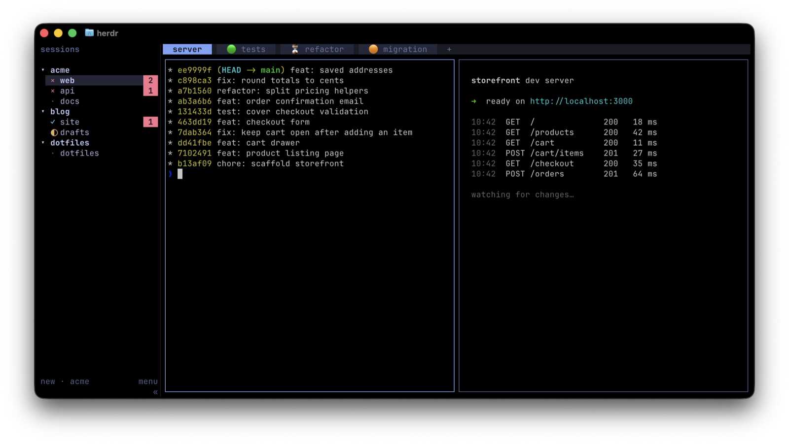

# Tab Status for Herdr

Shows which tabs need you, right in the tab bar:

- `🟢 checkout`: the agent finished and you haven't looked yet (Herdr's *done* state)
- `⏳ checkout`: the agent is working (*working*)
- `🟠 checkout`: the agent is waiting for your input or approval (*blocked*)
- `checkout`: anything else

A finished tab's marker disappears 2 seconds after Herdr sees you've looked at
the tab, so when you switch to a space you still see which tab had finished.
When a tab has several agents, the one that most needs you sets the
marker: blocked, then done, then working.



The markers in the tab bar come from this plugin. The sidebar, with several sessions and red
counts of waiting agents, comes from [Herdrsson, my fork of Herdr](https://github.com/bagonyi/herdrsson/blob/patches/FORK.md);
the plugin works the same with stock Herdr.

## How it works

Herdr's tab bar can't colour tabs by agent state, so the plugin puts a marker
in front of the tab's name. Herdr runs it when an agent's status changes, when
a tab or pane is created, renamed, focused or closed, and once at startup.
There is no background process; the only exception is a short-lived run
that removes a finished tab's marker once its 2 seconds are up. Each run checks
every tab against Herdr's own combined agent status for that tab, so a missed
event is corrected on the next run. To force a run: `herdr plugin action invoke bagonyi.tab-status.refresh`.

## Flagging tabs

To come back to a tab later, flag it: 🚩 goes in front of its name, after any
status marker (`🟠 🚩 checkout`), and stays until you flag the tab again. The
flag is part of the name, so it survives a restart. Flagging works on the tab
in front of you; bind it to a key in Herdr's `config.toml`:

```toml
[[keys.command]]
key = "cmd+shift+f"
type = "plugin_action"
command = "bagonyi.tab-status.flag"
description = "flag or unflag the focused tab"
```

Ghostty binds Cmd+Shift+F to closing its search bar. To use the key for
flagging, add `keybind = super+shift+f=unbind` to Ghostty's config; Escape
still closes the search bar.

## Requirements

- Herdr 0.9.3 or later
- macOS or Linux
- `python3` on `PATH` (standard library only)

Tested on macOS.

## Install

```sh
herdr plugin install bagonyi/herdr-tab-status
```

Herdr has no plugin update command yet; run the same command again to update.
To work on the plugin, clone this repo and link your checkout instead:
`herdr plugin link /path/to/herdr-tab-status`.

## Limitations

- **Unnamed tabs are left alone.** Herdr shows them by position number and
  has no way to return a renamed tab to automatic naming, so marking one would
  freeze its number. Name a tab (`prefix+shift+t`) to get markers. Flagging an
  unnamed tab names it `🚩 3`; unflagging leaves `3` as its name.
- **The marker and flag are part of the tab's name.** They show up in the rename
  dialog and anywhere the tab name appears, such as the outer terminal's window
  title. If you rename a marked tab, the plugin keeps your new name and manages
  the marker in front of it.
- **The marker is a coloured symbol, not a coloured tab.**

To change the markers, edit `MARKERS` at the top of `tab_status.py`; to
change the flag, `FLAG`; to change the delay, `SEEN_DELAY_SECONDS`.

## Debugging

To see what the plugin does, turn on its log by creating an empty file named
`log` in its config directory:

```sh
dir="$(herdr plugin config-dir bagonyi.tab-status)"
mkdir -p "$dir" && touch "$dir/log"
```

Each run then adds what started it, the tabs with a marker or an active agent,
and what it renamed to `tab_status.log` in the plugin's state directory
(`~/.local/state/herdr/plugins/bagonyi.tab-status/` by default). It records tab
names, not what runs in them, and keeps at most about 2 MB. Delete the `log`
file to turn it off again.

## Uninstall

Remove the markers first, so no tab keeps a stale one:

```sh
herdr plugin action invoke bagonyi.tab-status.clear
herdr plugin uninstall bagonyi.tab-status
```

If you linked a checkout, use `herdr plugin unlink bagonyi.tab-status` instead.
Flags stay, as they are part of the tab names; unflag those tabs first if you
don't want to keep them.

## License

Copyright 2026 David Bagonyi. Licensed under the [Apache License 2.0](LICENSE).
